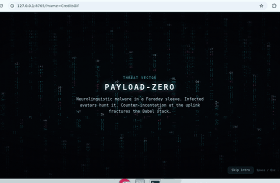
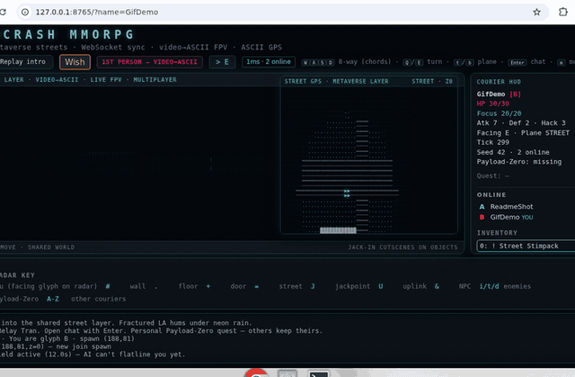

# Snowcrash

A short, playable cyberpunk **rogue-like / MMORPG prototype** in Python. **Dev** (`adventure-dev`, port **8766**) is a shared-world Metaverse street layer: many couriers, WebSocket realtime sync, chat, and personal Payload-Zero quests. Web client uses continuous **1st-person video→ASCII FPV** plus a GTA-style **enhanced ASCII minimap**; TUI stays single-player overhead ASCII.


## Screenshots

### Opening credits

<p align="center">
  
</p>

### Gameplay

<p align="center">
  
</p>


## Requirements

- Python 3.11+ (3.12/3.13 fine)
- Linux/macOS recommended for the curses TUI
- Web deps listed in `requirements.txt` (FastAPI + Uvicorn)

## Install

```bash
cd adventure
python3 -m venv .venv
source .venv/bin/activate
pip install -r requirements.txt
```

## Run — terminal (curses)

```bash
python -m snowcrash
python -m snowcrash --seed 42
```


## Play over SSH

SSH into the host, then from the repo root:

```bash
source .venv/bin/activate   # if you use a venv
./scripts/play_ssh.sh
# or:
python -m snowcrash --seed 42
# monochrome (safer on odd TERM / dumb relays):
python -m snowcrash --no-color
```

`play_ssh.sh` checks for an interactive TTY, sets `TERM` to `xterm-256color` when unset, activates `.venv` if present, and runs the curses TUI.

**Terminal size:** recommended **~80×24** (columns×rows). The TUI refuses to draw below **40×12** and shows a resize prompt instead. If the window is resized mid-play, `KEY_RESIZE` is handled safely.

If stdin is not a TTY (piped/non-interactive), the game prints a clear error and exits with status 1.


## Run — web

```bash
python -m snowcrash.web
# optional:
python -m snowcrash.web --host 0.0.0.0 --port 8765 --seed 42
```

Then open **http://127.0.0.1:8765/** (or your host’s IP on port **8765**).

## Deployments (production + dev)

| | Branch | Checkout | Port | Env flag |
|---|---|---|---|---|
| **Production** | `main` | `/workspace/adventure` (or repo root) | **8765** | `--env production` |
| **Dev** | `dev` | git worktree e.g. `adventure-dev` | **8766** | `--env dev` |

```bash
# production
./scripts/run_prod.sh          # → http://127.0.0.1:8765/

# development (from the dev worktree)
cd ../adventure-dev   # or: git worktree add ../adventure-dev dev
./scripts/run_dev.sh          # → http://127.0.0.1:8766/
```

Dev builds show a **DEV** badge in the HUD. Create the worktree once:

```bash
git fetch origin
git worktree add ../adventure-dev dev
```

Public tunnels (optional): point one Cloudflare quick tunnel at each port.


## MMORPG DEV (multiplayer prototype)

Dev deployment (`--env dev`, port **8766**) runs one shared `GameWorld`:

- **WebSocket** `/ws` — join with a display name, send movement/action intents, receive snapshots (~4 Hz AI tick + on action).
- **Other players** appear as letter/number glyphs (unique color) in FPV billboards and the ASCII GPS.
- **Chat** — press **Enter**, type a message (or `/say hi`), Send. Global chat for the demo.
- **Quest (anti-grief)** — each courier can clone **Payload-Zero** into a personal sleeve; the world copy remains so others are not soft-locked. Delivering to the uplink completes *your* win only.
- HTTP `/api/*` remains for static assets + bootstrap fallback; live play uses the socket.

### Play together (two browsers)

1. Start (or restart) the **dev** server only — leave production `:8765` alone:

```bash
cd /workspace/adventure-dev   # git branch `dev`
./scripts/run_dev.sh          # 0.0.0.0:8766 --env dev
```

2. Open two windows on the same host:
   - Local: http://127.0.0.1:8766/?name=Alice and http://127.0.0.1:8766/?name=Bob
   - Or the Cloudflare quick tunnel pointed at **8766**
3. Skip intro if you like. Move with WASD — each should see the other’s glyph move on GPS/FPV. Press Enter to chat.

Reconnect with the **same name** to reclaim your avatar after a disconnect.


On first load (and **Replay intro** / restart after death-win) the web UI plays a fullscreen **opening cinematic**: high-fidelity **colored ASCII video** (canvas sample of a procedural MP4) with timed story beats for Rin Vale / Payload-Zero. **Space / Esc / Skip intro** dismisses it, then the playable HUD starts (WebSocket join is deferred until the intro ends so gameplay SFX do not overlap).

The main viewport is live **video→ASCII FPV**: neon raycast scene → shared colored-ASCII canvas (same pipeline as the intro). A corner **Street GPS** radar shows an **enhanced-resolution ASCII** crop of the glyph map (not PNG tiles) — colorized, 2×2 upscaled cells, facing marker.
Short procedural SFX play for move/combat/loot — **Mute** / **m** (localStorage; default volume ~0.4).
Jackpoint / uplink / payload / NPC / terminal / door trigger **jack-in video→ASCII cutscenes** (MP4 preferred, JSON fallback; Space/Esc skip). TUI has no FPV/cutscenes yet.
Quest rooms: **J** jackpoint, **U** Metaverse uplink.

To regenerate sprites after editing `scripts/gen_tiles.py`:

```bash
source .venv/bin/activate
pip install pillow   # generator only; not a runtime dep
python scripts/gen_tiles.py
```

To regenerate SFX WAVs (stdlib only — no extra deps):

```bash
python scripts/gen_sfx.py
python scripts/gen_cutscenes.py   # stdlib ASCII cutscene packs
python scripts/gen_intro_video.py      # Pillow + ffmpeg → colored-ASCII intro MP4
python scripts/gen_cutscene_videos.py  # short jack-in MP4s (same ASCII pipeline)
```

## Controls

| Key | Action |
|-----|--------|
| `W`/`S` (web) | Forward / back (relative to facing) |
| `A`/`D` (web) | Strafe left / right |
| `Q`/`E` or ←/→ (web) | Turn left / right |
| `WASD` / arrows / `hjkl` (TUI) | Absolute move |
| `g` | Get / pick up |
| `i` | Inventory |
| `e` | Equip / unequip (in inventory) |
| `u` | Use item (inventory selection, or click item on web) |
| `d` | Drop (inventory) |
| `f` | Ranged pulse (if pistol equipped) or **hack** attack |
| `.` / Space | Wait |
| `?` | Help |
| `r` | Restart (after death/win) |
| `q` | Quit (TUI) |
| `m` (web) | Mute / unmute SFX |
| `j` (web) | Jack in at jackpoint `J` / jack out in cyberspace (else absolute south) |
| `Shift+J` (web) | Open quest journal |
| `z` / `x` / `c` (web) | ICE probes: Stun / Reveal / Scramble |
| `p` (web) | Open ICE dock |
| Space / Esc (web) | Skip opening intro or 1st-person cutscene |
| `z`/`x`/`c` (web) | ICE probes: stun / reveal / scramble ([docs](docs/ice-probes.md)) |
| `p` (web) | Open ICE dock panel |
| `j` (web) | Jack in at `J` / jack out in cyberspace ([docs](docs/cyberspace.md)); else absolute south |

Bump into NPCs to talk. Walk onto items and press `g`. Bring **Payload-Zero** next to the Metaverse uplink custodian to win.

## Perspective / FPV + minimap

**Shared ASCII pipeline:** `snowcrash/static/ascii-video.js` exports `AsciiRenderer` + `VideoAsciiCanvas`. Both sample luminance to a dense charset and paint **per-glyph RGB** from the source — works with `<video>`, an offscreen scene canvas (`setSourceCanvas` / `renderFromCanvas`), or `ImageData` (`renderFromImageData`). Intro, live FPV, and jack-in cutscenes all share this look.

**Opening cinematic:** `VideoAsciiCanvas` plays `static/cutscenes/intro/montage.mp4` fullscreen. Rebuild with `python scripts/gen_intro_video.py` (Pillow + ffmpeg).

**Web gameplay FPV:** each move/turn (plus a low-rate idle rAF for scanlines/noise) paints a neon first-person scene (perspective walls, ceiling/floor gradients, entity billboards) to an offscreen canvas, then samples it through the same ASCII renderer onto `#fpv-canvas`. Tuned for **high glyph contrast** (brightness/contrast/gamma/saturation + soft vignette) so continuous play stays readable — not a plain `<pre>` raycaster. See `docs/fpv.md`.

**Street GPS:** enhanced ASCII minimap (glyph language, 2×2 upscaled/colorized) in matching METAVERSE LAYER chrome.

Movement is **relative to facing** (GTA-like): `W/S` forward/back, `A/D` strafe, `Q/E` (or arrows) turn.

**Jack-in cutscenes** prefer short procedural MP4s (`static/cutscenes/<id>.mp4`) through `VideoAsciiCanvas`; JSON packs remain as fallback (rendered onto the same canvas with neon coloring):

| Trigger | Cutscene id |
|---------|-------------|
| Near jackpoint (`J`) first time | `jackpoint` |
| Pick up Payload-Zero | `payload` |
| Talk to an NPC | `talk` |
| Use a datachip | `terminal` |
| Walk through a door (once) | `door` |
| Win at Metaverse uplink | `uplink` |

```bash
python scripts/gen_cutscenes.py         # JSON ASCII packs
python scripts/gen_cutscene_videos.py   # short MP4s for jack-in (Pillow + ffmpeg)
```

## Map landmarks

- **Safehouse** (NW) — briefing with Relay Tran
- **Neon Club** (NE) — tips + pulse pistol loot
- **Jackpoint** (SW, `J`) — Payload-Zero + hostile security
- **Uplink** (SE, `U`) — deliver / neutralize to win

Enemies: `i` infected avatars, `t` street thugs, `d` security drones.
Web tiles live in `snowcrash/static/tiles/` (see `tiles.json` for glyph → sprite + legend labels).


## Features / Docs

Shipped on **`dev`** (MMORPG web). Player-facing notes:

| Feature | Doc | Issues |
|---------|-----|--------|
| ICE probe quickhacks (Focus) | [docs/ice-probes.md](docs/ice-probes.md) | #46 · parent #42 |
| Jack-in cyberspace puzzle layer | [docs/cyberspace.md](docs/cyberspace.md) | #47 · parent #42 |
| Signal Keys scavenger hunt | [docs/signal-keys.md](docs/signal-keys.md) | #45 · parent #42 |
| Neon Dash timed street race | [docs/neon-dash.md](docs/neon-dash.md) | #48 · parent #42 |
| Corp patrol pressure (heat) | [docs/corp-patrol.md](docs/corp-patrol.md) | #50 · parent #42 |
| Soft hardcore (opt-in death tax) | [docs/soft-hardcore.md](docs/soft-hardcore.md) | #49 · parent #42 |
| Year backend actions / snapshot fields | [docs/year_backend_actions.md](docs/year_backend_actions.md) | year roadmap |
| Staging / migrations | [docs/staging.md](docs/staging.md) | — |

Steam packaging research is tracked separately as **#67** (not covered by these docs).

## Package layout

```
adventure/
  LICENSE
  README.md
  requirements.txt
  snowcrash/
    __main__.py          # TUI entry
    engine.py            # shared game logic
    mapgen.py, entities.py, items.py, constants.py
    tui/app.py           # curses frontend
    web/                 # FastAPI frontend
      __main__.py
      app.py
    templates/index.html
    static/{style.css,game.js,ascii-video.js,tiles/,sfx/,cutscenes/,cutscenes/intro/}
  scripts/play_ssh.sh    # SSH/TTY-safe TUI launcher
  scripts/gen_tiles.py   # Pillow one-shot sprite bake
  scripts/gen_sfx.py     # stdlib procedural WAV bake
  scripts/gen_cutscenes.py  # stdlib 1st-person ASCII packs
  scripts/gen_intro_video.py  # Pillow+ffmpeg opening montage MP4
```

## License

MIT — see `LICENSE`.
