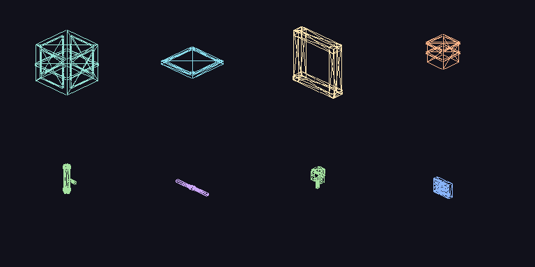

# Godot 3D Metaverse presentation

Issue **#141** (parent play loop **#118** · quality bar **#130** · Deck **#132** · onboarding **#133** · audio **#134** · visual bar **#163**).

**Steam presentation goal:** the shipped desktop SKU is a **true 3D street** (Godot `Node3D` world + courier camera), not a text HUD wrapper. Python `/ws` stays game authority. ASCII FPV / overhead map remain as overlay, accessibility, and debug — they are **not** deleted.

Godot **may be missing** on this box. Files under [`godot_client/`](../godot_client/) are valid Godot **4.3+** scenes (open locally).

---

## Architecture (unchanged authority)

```
┌──────────────────────────────────────────────┐
│  Godot 4 presentation                        │
│  Street3D (meshes / camera / VFX / lights)   │
│  Control HUD · docks · StreetNet · ASCII     │
│  WebSocketPeer  →  ws(s)://host:port/ws      │
└──────────────────┬───────────────────────────┘
                   │ JSON snapshots + intents
┌──────────────────▼───────────────────────────┐
│  snowcrash.web  GameWorld (Python)           │
└──────────────────────────────────────────────┘
```

Thin-client rule still holds: **Godot never simulates the street.** It paints `snapshot.state.map` / `player` / `entities` / `players` / `jackpoint` / `uplink` and sends the same named intents as web (`forward`, `turn_left`, …).

---

## Visual bar (#163)

**Cite, do not copy.** [Abandoned Spaceship Godot Demo](https://github.com/perfoon/Abandoned-Spaceship-Godot-Demo) (Perfoon) + shipped [BLASTRONAUT](https://store.steampowered.com/app/1392650/BLASTRONAUT/) is the Godot commercial **look** bar for the Steam 3D SKU. Parent assessment: [#163](https://github.com/8r4n/adventure-snowcrash/issues/163) · quality-bar write-up: [steam-quality-bar.md](steam-quality-bar.md#godot-commercial-look-bar-abandoned-spaceshipclass).

The demo is a **tech-art showcase** (authored hangar, baked lightmaps, trim-sheet recolor, volumetrics) — not a live MMORPG. We want store screenshots to read “finished Godot product,” not untextured primitives. Python `/ws` stays sole game authority.

### What we will copy (spirit)

- Material / lighting / atmosphere **craft** so High-preset street + ICE stills sit closer to that density
- Trim-sheet + recolor-shader *idea*, driven by **Catppuccin** roles (Teal / Sky / Peach / Yellow / …)
- High-preset GI / AO / TAA / volumetric stack that still leaves Deck **Low** at the 30 fps floor (#148)
- Diegetic in-world screens and cosmetic camera juice — presentation only

### What we will not copy

- Meshes, textures, lightmaps, or shaders from the Abandoned Spaceship repo (not our IP; non-goal)
- Fully authored static levels as the only street (our city is live `/ws` snapshot → AOI `PrimitiveMesh` / later modular kit)
- Per-prop Omni spam (Deck budget stays **courier + J + U**)
- Dropping ASCII overlay / web / TUI companions
- Becoming a static walkable scene

### Child issues (checklist)

Keep parent epics #163 / #141 open from a single child. Use `Refs #163` · `Refs #141`.

- [x] [#156](https://github.com/8r4n/adventure-snowcrash/issues/156) Trim-sheet / PBR + Catppuccin recolor shader
- [x] [#157](https://github.com/8r4n/adventure-snowcrash/issues/157) High-preset SSAO/SSIL/TAA/volumetric + probes
- [x] [#158](https://github.com/8r4n/adventure-snowcrash/issues/158) Modular corridor + prop kit (authored meshes, snapshot-placed)
- [x] [#159](https://github.com/8r4n/adventure-snowcrash/issues/159) Ground blend (street / grass / water / rubble)
- [ ] [#160](https://github.com/8r4n/adventure-snowcrash/issues/160) Diegetic in-world screens (StreetNet / ads / jack terminals)
- [x] [#161](https://github.com/8r4n/adventure-snowcrash/issues/161) Camera juice (look smooth, bob, FOV) without breaking WS grid authority
- [x] [#162](https://github.com/8r4n/adventure-snowcrash/issues/162) Docs: this section + [steam-quality-bar.md](steam-quality-bar.md) cite (this PR)

---

## How to open the 3D view

1. Start the **dev** server: `./scripts/run_dev.sh` → `ws://127.0.0.1:8766/ws`
2. Godot 4.3+ → Import `godot_client/project.godot` → **F5**
3. Enter a courier name → **Jack in**
4. Default viewport is **3D street** (neon corridor from the live snapshot)
5. **V** / Select / View button cycles **3D → 3D+ASCII overlay → FPV ASCII → overhead map → 3D**
6. **C** / Cam button / R3 toggles **close 3rd-person ↔ first-person**
7. Move/look: WASD + Q/E, left stick, L1/R1, **right stick X → turn** (same WS intents)

HUD, inventory, year docks, and StreetNet stay as Control overlay. ASCII path is `fpv_ascii.gd` (unchanged).

---

## Glyph → mesh catalog (slice 1)

| Glyph | Role | 3D mesh | Catppuccin |
|-------|------|---------|------------|
| `#` | wall | box, 2.55 m | Teal / Sky emission (checker) |
| `.` | floor | thin slab | Surface 0 |
| `=` | street | slab + neon tick | Mantle + Yellow |
| `,` | grass | slab | Green darkened |
| `~` | water | translucent slab | Sapphire-ish Sky |
| `+` | door | yellow frame | Yellow emission |
| `o` | manhole | disc | Overlay 0 |
| `<` `>` | stairs | stepped box | Lavender |
| `J` | jackpoint | tall plinth + pillar + emissive shaft + glyph disc + big `J` billboard + pulse Omni | Sky |
| `U` | uplink | taller peach beacon + dual ring + emissive shaft + big `U` billboard + pulse Omni | Peach |
| `$` | vendor | emissive kiosk + canopy + mast + `$` glyph disc (from `landmarks`; no Omni) | Yellow / Peach |
| `@` | self | teal capsule + head + facing chevron (hidden in 1st) | Teal |
| letter / `players` | other couriers | tall blue capsule + head + sky facing chevron + nameplate | Blue / Sky |
| `&` | NPC | short lavender capsule + larger head | Lavender |
| `i` | infected | hunched green box + offset head | Green |
| `t` | thug | wide peach slab + disc head | Peach |
| `d` | drone | hovering mauve sphere + torus ring | Mauve |
| `B` | boss | oversized red capsule + ring | Red |
| `c` | street cam | red box on prop pole | Red |
| `*` | loot / pickup | yellow spark + disc (map `*` + signal-key landmarks) | Yellow |
| `I` | ICE cell (jacked) | translucent cyan barrier + node sphere | Blue / Sky |
| `%` | node core (jacked) | pink sphere + ring | Pink |
| `X` | node exit (jacked) | green portal ring | Green |
| `A` | Null Choir stub (heist L3) | oversized red capsule + ring | Red |
| ` ` | void / fog | skipped | — |

Landmarks **J** / **U** spawn from `state.jackpoint` / `state.uplink`. **Vendors** and signal-key loot also read `state.landmarks` (`glyph` `$` / `*`). Other `state.entities` / `state.players` use pooled multi-part meshes + `Label3D` billboards. **Facing chevrons** use snapshot `facing` for self + other couriers (agents).

Map rebuild is **AOI-cropped** (`BUILD_RADIUS` 18) and hashed so a 200×120 city does not instantiate every tile. Entities are **pooled** (cap `MAX_POOLED_ENTITIES` 48) with shared `PrimitiveMesh` + materials — no per-snap alloc, no per-vendor Omni (Deck light budget stays courier + J + U).

---

## Cyberspace / ICE 3D (slice 3)

Jack-in is a **client visual swap**. Python `/ws` already swaps `snapshot.map` to the node lattice while `mode` is `cyberspace` or `heist` (same fields the web overlay uses). Godot does **not** rewrite the server.

### How ICE 3D triggers

Same predicates as web `game.js` (`renderCyberHint` / overlay) and Godot `AudioManager` (#134 ice bed):

```
in_ice =
    state.mode == "cyberspace" || state.mode == "heist"
    || state.cyberspace.active
    || state.ice_heist.active
```

| Field | Role |
|-------|------|
| `mode` | `"cyberspace"` / `"heist"` while jacked |
| `cyberspace.active` | maze / ICE-gate node live |
| `cyberspace.px` / `py` | **avatar** tile (street `player.x/y` stays parked at J) |
| `cyberspace.node_type` | `maze` / `ice_gate` |
| `cyberspace.ice_remaining` / `loot_taken` / `hint` | HUD + layer plate |
| `ice_heist.active` | Black Lattice Vault live |
| `ice_heist.layer` / `layers` | 1–3; names Perimeter Scrub / Honeycomb Lattice / Core Sanctum |
| `ice_heist.px` / `py` | vault avatar tile |
| `ice_heist.ai` | Null Choir stub (L3) |
| `street_map_paused` | set by server while jacked |

**Critical:** street body coords stay at the jackpoint. 3D courier pose uses `ice_avatar_xy()` → `ice_heist.px/py` else `cyberspace.px/py` else `@` on the swapped map. Street landmarks (J / U / vendors) and street entity pool are hidden while jacked.

### Visual language (not street brick)

| Street | Jacked lattice |
|--------|----------------|
| Teal brick `#` boxes | Thin neon **frame + translucent fill** + crown node spheres |
| Street slab + yellow lane tick | Dark **grid floor** (cross ticks) + mauve lattice nodes |
| Night fog + sky rim Directional, glow 0.55 (High) | Cyan void, mauve rim, denser fog, glow 0.88 / bloom 0.22 |
| J / U Omni beacons | No extra lights — emissive ICE / core / exit only |

`I` cells are tall cyan barriers (melt with **Z stun / X reveal**). `%` core and `X` exit are labeled portals. Heist L3 `A` is the Null Choir stub.

### Layer indicators + juice

- HUD `IceBanner` + floating Label3D plate: `CYBER · ICE GATE · ICE n` or `HEIST · L2/3 · Honeycomb Lattice · ICE n`
- Heist layer **pips** (3 spheres; current layer pink)
- Jack-in / jack-out: FOV punch + fullscreen flash + `pulse` SFX; music already swaps to `ice_jackin.wav` (#134)
- **J** jack_in (when `cyberspace.can_jack_in`) / jack_out; dock **Jack** button flips to Jack out

Deck: ICE maps are 9–13 tiles (whole node inside `BUILD_RADIUS`). No extra Omni.

---

## Camera + input

| Mode | Rig |
|------|-----|
| **3rd** (default) | Close over-shoulder, courier capsule visible |
| **1st** | Eye-height, mesh hidden |

Facing is server `player.facing` (N/E/S/W). Position lerps toward tile centers — no client prediction, no new server APIs.

Right stick X is mapped to `look_left` / `look_right` and sent as **`turn_left` / `turn_right`** (existing intents). Keyboard Q/E and L1/R1 unchanged.

### Camera juice (#161) — cosmetic vs authority

Presentation-only feel so the 3D SKU reads closer to Abandoned Spaceship–class free-look **without** client-side position cheating.

| Layer | What happens | Authority? |
|-------|--------------|------------|
| **Server pose** | `player.x/y` + `facing` (or ICE avatar `px/py`) from `/ws` snapshot | **Truth** |
| **Intents** | `forward` / `turn_left` / … unchanged | Server resolves |
| **Courier mesh lerp** | `Street3D` lerps render pose toward tile centers (`look_pos_rate`) | Cosmetic |
| **Entity mesh lerp** | Pooled agents lerp between grid cells; snap on first paint / long teleport | Cosmetic |
| **Look smoothing** | Softer yaw follow (`look_yaw_rate`); toggle via ConfigFile `look_smooth` (default on) | Cosmetic |
| **Head bob** | Optional cam-pivot bob while the mesh is mid-lerp; **F7** / **Bob** button | Cosmetic |
| **Landing FOV** | Brief FOV punch when the cosmetic mesh settles on a cell | Cosmetic |

**Deck / Low:** `GraphicsSettings.head_bob()` always returns **false** on Low (pref may stay on for High). Bob defaults **off** in ConfigFile. Omni budget unchanged.

`Refs #163` · `Refs #141` — epics stay open.

---

## Renderer + Deck perf budget

| Surface | Renderer | Why |
|---------|----------|-----|
| **Desktop Steam** | **Forward+** (`project.godot` `rendering_method=forward_plus`) | Clustered Omni lights, glow/bloom on neon materials |
| **Deck / Android** | **Mobile** (`rendering_method.mobile=mobile`) | Same scenes; cheaper clustered lights; glow still works |
| Fallback | GL Compatibility | Glow ignored; meshes still playable if someone force-switches |

### Omni / light budget (hard limit)

| Light | Type | Counts vs Omni budget? | Notes |
|-------|------|------------------------|-------|
| Moon / Key | `DirectionalLight3D` | **No** | Street fill / ICE cyan / globe key |
| **Rim** (slice 5) | `DirectionalLight3D` | **No** | Neon sky/mauve rim — High only |
| Courier `EyeLight` | `OmniLight3D` | **Yes (1)** | Always on while in street/ICE |
| Jackpoint J | `OmniLight3D` | **Yes (1)** | Pulsed; street only |
| Uplink U | `OmniLight3D` | **Yes (1)** | Pulsed; street only |
| Globe `FillLight` | `OmniLight3D` | Globe viewport only | Separate SubViewport; street Omnis not active |
| Vendors / pickups / ICE cells | emissive mats | **No Omni** | Never add per-prop lights |

**Street Omni ceiling = 3** (courier + J + U). Rim/moon are Directional — neon without blowing the Deck clustered-Omni budget.

### Quality preset (Low / High)

Persisted in `user://snowcrash_client.cfg` section `[graphics]` via autoload `GraphicsSettings`. Toggle: HUD **Quality** button or **F8**.

| Knob | Low (Deck floor) | High (desktop neon) |
|------|------------------|---------------------|
| AOI `build_radius` | **12** (#148 Deck headroom; was 14) | 18 |
| Entity radius / pool | **10 / ≤24** (#148; was 12 / ≤28) | 16 / ≤48 |
| Particles (rain / dust / spark) | **off** | on |
| Glow / bloom | off (or dim stub) | on |
| MSAA 3D (SubViewport) | off | 2× |
| Rim Directional | off | on |
| Materials (#156) | albedo + procedural trim (no normal/ORM) | trim albedo + normal + ORM |
| Kit scatter (#158) | off (AOI mesh headroom) | crates / pipes / foliage / vents |
| Ground blend (#159) | single tinted albedo | world-space multi-tex + rubble chips |
| Head bob (#161) | **forced off** | optional (F7; default off) |
| Look smooth (#161) | on (cosmetic yaw/pos rates) | on (default) |
| SSAO (#157) | **off** | on |
| SSIL (#157) | **off** | on |
| TAA (#157) | **off** | SubViewport `use_taa` |
| Volumetric fog (#157) | **off** (classic fog only) | denser neon shafts |
| ReflectionProbe (#157) | **off** | J / U / ICE core+exit only |

### Particles (slice 5)

| FX | Where | Notes |
|----|-------|-------|
| Rain | Street, follows courier | Cheap `GPUParticles3D` (~64) |
| Neon dust | Street + ICE | Sparse rising / lattice motes |
| Uplink spark | At **U** when in AOI | Peach sparks; High only |
| Orbit dust | Globe | Sphere emission around Earth |

All particle systems respect the quality preset (disabled on Low).

**Targets:**

| Device | Goal | Budget knobs |
|--------|------|----------------|
| Mid PC (1080p) | **60 fps** comfortable, **30 fps** floor | High preset; MSAA 2×; Forward+ glow |
| Steam Deck (800p) | **30 fps** floor | Prefer **Low** preset; Mobile renderer; shadows off; ≤3 Omnis; `UPDATE_WHEN_VISIBLE` |
| Low PC | 30 fps | Low preset |

Honesty: **no Deck / mid-PC hardware pass yet** for measured frame times — see [FPS measurement (#148)](#fps-measurement-148). Do not claim Verified from budget alone.

---

## FPS measurement (#148)

Replace budget-only notes with an **in-client harness** so device QA can record real numbers without rebuilding.

### Overlay + logger

| Control | Action |
|---------|--------|
| **F3** | Toggle FPS overlay (Catppuccin sky Label, `mouse_filter = IGNORE`) |
| **Shift+F3** | Append one JSONL sample to `user://fps_samples.log` |
| `--fps-log` | Continuous samples every ~2s (also shows overlay) |

Overlay shows rolling avg fps / ms, quality (Low/High), scene mode (`street` / `street_ascii` / `ice` / `ice_ascii` / `globe` / `fpv` / `map`), MSAA, particles, glow, and AOI knobs (`build_radius` / `entity_radius` / `max_pooled`).

Autoload: `godot_client/scripts/fps_meter.gd` (`FpsMeter`). Scene mode comes from `main.gd` (`fps_scene_mode()`).

### Measurement protocol

Run a built or editor client against a live `/ws` realm. For each **Device × Scene × Quality** cell:

1. Set quality (**F8** / HUD Quality) to **Low** or **High**.
2. Enter the scene (street idle: park; street combat: firefight / dense AOI; ICE: jack in; globe: open Globe dock).
3. Press **F3** so the overlay is visible; wait ≥3s for the rolling window.
4. Hold **Shift+F3** once at ~10s, again at ~30s (or use `--fps-log` for continuous lines).
5. Record avg fps from overlay and p99-ish ms from samples (`ms` field). Note particle/Omni load.

Minimum matrix: **street idle**, **street combat**, **ICE**, **globe** × **Low** + **High** × mid-PC + Deck (or Deck-like). Prefer 30s sustained samples.

### Bottlenecks (code-derived)

| Risk | Where | Notes |
|------|-------|-------|
| **Particles** | High only — rain / neon dust / uplink spark / globe orbit | Low disables all `GPUParticles3D` |
| **Omni lights** | Street ceiling = **3** (courier `EyeLight` + J + U) | No vendor / pickup Omnis; globe Fill is a separate SubViewport |
| **AOI entity count** | `GraphicsSettings` pool + radii | Low: build 12 / entity 10 / pool ≤24; High: 18 / 16 / ≤48 |
| **Glow / MSAA** | High SubViewport + WorldEnvironment | Low: MSAA off, glow off/dim |
| **PBR maps (#156)** | High: normal + ORM on shared trim shader | Low: `materials_use_orm()` false — albedo / procedural only |
| **SSAO / SSIL / TAA / vol (#157)** | High only — Forward+ neon stack | Low: all off; prefer Low on Deck (#148) |
| **ReflectionProbe (#157)** | High: jackpoint / uplink / ICE core+exit | Low: none; never per-tile |

### Low default tweak (#148)

Without hardware numbers, street combat on Deck is the riskiest cell (particles off already on Low; Omnis fixed). Low AOI was tightened slightly so the floor has more headroom without gutting silhouettes:

| Knob | Prior Low | Low now | High |
|------|-----------|---------|------|
| `build_radius` | 14 | **12** | 18 |
| `entity_radius` | 12 | **10** | 16 |
| `max_pooled_entities` | 28 | **24** | 48 |

High preset unchanged. Revisit after a real Deck pass if Low still dips under 30 fps in street combat — or if 12/10 feels too tight for landmark readability.

### Results table

Fill on device; keep TBD until measured. Do not invent numbers.

| Device | Scene | Quality | avg fps | p99 ms | notes |
|--------|-------|---------|---------|--------|-------|
| Mid-PC (TBD hardware) | street idle | Low | TBD | TBD | protocol ready |
| Mid-PC (TBD hardware) | street idle | High | TBD | TBD | |
| Mid-PC (TBD hardware) | street combat | Low | TBD | TBD | |
| Mid-PC (TBD hardware) | street combat | High | TBD | TBD | particles + glow |
| Mid-PC (TBD hardware) | ICE | Low | TBD | TBD | |
| Mid-PC (TBD hardware) | ICE | High | TBD | TBD | |
| Mid-PC (TBD hardware) | globe | Low | TBD | TBD | |
| Mid-PC (TBD hardware) | globe | High | TBD | TBD | |
| Steam Deck (TBD) | street idle | Low | TBD | TBD | Verified path needs device |
| Steam Deck (TBD) | street idle | High | TBD | TBD | |
| Steam Deck (TBD) | street combat | Low | TBD | TBD | **30 fps floor** |
| Steam Deck (TBD) | street combat | High | TBD | TBD | expect heavier |
| Steam Deck (TBD) | ICE | Low | TBD | TBD | |
| Steam Deck (TBD) | ICE | High | TBD | TBD | |
| Steam Deck (TBD) | globe | Low | TBD | TBD | |
| Steam Deck (TBD) | globe | High | TBD | TBD | |

CI / this agent: **no Godot binary / no Deck** — harness + protocol only. Paste real rows from `user://fps_samples.log` when hardware is available.

---

## Slice progress

| # | Slice | Status |
|---|-------|--------|
| 1 | **3D street vertical slice** — glyphs → meshes, courier camera, WS intents, J/U, ASCII toggle | Done (#142) |
| 2 | **Entities polish** — distinct silhouettes, facing chevrons, vendors `$`, pickups, landmark billboards | Done (#143) |
| 3 | **Cyberspace / ICE** — distinct 3D visual language for jack-in layers | Done (#144) |
| 4 | **Globe** — 3D Earth / region picker hybrid with year dock | Done (#145) |
| 5 | **Polish** — lighting, particles, materials, quality preset, Deck budget | Done (#146) |
| 6 | **Optional ASCII overlay** — hybrid FPV on live 3D | **This PR** |

**#141 stays OPEN** until the Steam-ready 3D loop (acceptance on the issue). This PR is `Refs #141` only (do not close the epic).

### Slice 1 acceptance (partial)

- [x] Playable 3D street driven by live `/ws` snapshots (no server rewrite)
- [x] Courier move + facing via existing intents + gamepad map
- [x] J / U landmark readability
- [x] `docs/godot-3d.md` design + progress
- [x] `docs/godot-client.md` + [steam-quality-bar.md](steam-quality-bar.md) state **3D is the Steam presentation goal**
- [x] FPS harness + protocol (#148); hardware fps rows still **TBD** until device pass
- [x] Landmark / vendor pass without any HUD soup — #150 (onboarding dock gate #133 kept)

### Slice 2 acceptance (shipped #143)

- [x] Other players / NPCs / enemies as **distinct** multi-part meshes (silhouette + Catppuccin), not identical boxes
- [x] Vendors (`$`), jackpoint **J**, uplink **U** as readable emissive landmarks + billboards
- [x] Items / pickups when map or `landmarks` expose `*`
- [x] Facing indicators for agents (self + other couriers from snapshot `facing`)
- [x] Deck-conscious pooling / shared meshes; no extra Omni lights for vendors
- [x] `docs/godot-3d.md` slice 2 progress updated

### Slice 3 acceptance (shipped #144)

- [x] Distinct 3D visual language while jacked (grid / node lattice / neon ICE walls — not street brick)
- [x] Triggered from snapshot `mode` / `cyberspace.active` / `ice_heist.active` (same as web)
- [x] Courier pose from `cyberspace.px/py` or `ice_heist.px/py` (street body stays parked)
- [x] Heist layer indicators (L1–L3 names + pips + ICE remaining)
- [x] Jack-in / jack-out transition juice; reuse #134 `pulse` + `ice_jackin` bed
- [x] Still driven by `/ws` map/entities — no server rewrite
- [x] `docs/godot-3d.md` slice 3 progress updated

---


## Globe 3D / hybrid (slice 4)

Region pick + uplink teleport stays on existing `/ws` actions (`globe`, `teleport`, `globe_search`, `globe_filter`, `globe_zoom`, `globe_recall`, `globe_close`). Godot only paints.

### How to open globe 3D

1. Jack in (3D street default)
2. Open the **Globe** year dock (dock bar **Globe**, or cycle docks with Start / Menu)
3. Main view swaps street SubViewport → **GlobeHost** SubViewport (stylized Catppuccin Earth)
4. Existing dock UI stays on the right: search, ASCII filter, zoom ladder, region list, Teleport
5. Close the dock (or cycle past it) → `globe_close` → street 3D restored

ICE / street modes are untouched — globe overlay only while the Globe dock is open and view mode is 3D.

### Pins + hop

| Source | Role |
|--------|------|
| `globe.regions[]` | `id`, `name`, `lat`, `lon`, `home`, `has_ascii_shard`, … |
| `globe.region_id` / `region` | Current sleeve (teal pin) |
| `globe.cost_credits` | Hop cost (HUD + dock) |
| `globe.cooldown_remaining` | Cooldown feedback (peach when waiting) |
| `globe.zoom` | Camera distance ladder (`street` / `region` / `globe`) |
| `globe.search` / `filter_ascii` | Pin visibility filter (mirrors dock) |

- **Click** pin → select (yellow pulse + dock “Selected pin”)
- **Double-click** pin / dock **Teleport** / gamepad **A** → `teleport <region_id>`
- Drag / right-stick orbit; mouse wheel nudges camera distance
- Home = green, ASCII pilots = sky, other = mauve

Deck: simple sphere + emissive pin spheres (no Earth texture, no extra Omni beyond fill). Globe SubViewport uses `UPDATE_WHEN_VISIBLE` only while the dock is open.

### Slice 4 acceptance (shipped #145)

- [x] 3D Earth (stylized sphere + grid) with region pins from snapshot `globe` / `regions`
- [x] Select pin → hop via existing `teleport` intent; cost / cooldown in HUD (`GlobeBanner`)
- [x] Hybrid SubViewport overlay when Globe dock opens; year-dock search / filter / zoom kept
- [x] Catppuccin neon look; Deck-conscious (sphere + markers, no photoreal texture)
- [x] Street + ICE 3D modes intact; no server rewrite
- [x] `docs/godot-3d.md` slice 4 progress updated

---
## Lighting / particles / quality (slice 5)

Presentation polish only — Python `/ws` unchanged. ASCII overlay landed in slice 6.

### Visual
- Street: warmer Catppuccin ambient + denser night fog; **sky rim** Directional opposite the moon
- ICE: cyan ambient/fog; **mauve rim**; rain off, lattice dust on (High)
- Globe: mauve rim + orbit dust; still **one** Fill Omni
- Materials: slightly hotter wall / street emission for neon rim without extra Omnis

### Slice 5 acceptance (this PR)

- [x] Better street + ICE + globe lighting (rim Directional + fog/ambient) without exceeding Omni budget
- [x] Light particles (rain / neon dust / uplink spark) — toggleable via quality
- [x] Low disables particles + MSAA/glow; shrinks AOI; documented in this file + [steam-deck.md](steam-deck.md)
- [x] Low/High quality preset persisted in ConfigFile (`GraphicsSettings`)
- [x] Honest Deck QA: still **not measured on hardware**; checklist updated
- [x] `Refs #141` only — epic stays OPEN (slice 6 was still open at merge time)

---

## ASCII overlay / hybrid (slice 6)

Optional hybrid look: semi-transparent FPV ASCII drawn on top of the live **3D street / ICE** SubViewport. Python `/ws` unchanged.

### Toggle

| Control | Behavior |
|---------|----------|
| **V** / Select / **View** button | Cycle **3D → 3D+ASCII → FPV → map → 3D** |
| ConfigFile | `user://snowcrash_client.cfg` section `[view]` key `mode` (`3d` / `3d_ascii` / `fpv` / `map`) |

Overlay `AsciiOverlay` Label uses `mouse_filter = IGNORE` so year docks / StreetNet / buttons stay clickable. Font alpha ≈ 0.55 over the neon meshes. Globe dock still swaps to Earth SubViewport (overlay hidden while globe is up). While jacked, FPV/overlay raycasts from `ice_avatar_xy()` (lattice avatar), not the street body parked at **J**.

### Slice 6 acceptance (this PR)

- [x] Semi-transparent ASCII FPV overlay on live 3D street / ICE
- [x] **V** cycle includes hybrid step; ASCII-only + map kept
- [x] Overlay Label `mouse_filter = IGNORE` (docks work)
- [x] View mode persisted in ConfigFile
- [x] `docs/godot-3d.md` — slices 1–6 shipped; Steam-ready gaps listed
- [x] `Refs #141` only — **epic stays OPEN**

### Remaining Steam-ready gaps (keep #141 open)

Epic acceptance still unmet / not device-QA’d:

- [x] FPS overlay + logger + protocol (#148) — hardware result rows still TBD (no Deck/mid-PC pass yet)
- [x] Landmark / vendor readability **without HUD soup** — [#150](https://github.com/8r4n/adventure-snowcrash/issues/150) (J/U/$ silhouettes + objective cue; docks still gated by #133)
- [ ] Deck Verified path — export + hardware checklist still open ([steam-deck.md](steam-deck.md))
- [x] Desktop export builds (Linux / Windows) toward Steam — [#149](https://github.com/8r4n/adventure-snowcrash/issues/149) / [godot-desktop-export.md](godot-desktop-export.md) (macOS optional later)
- [ ] Abandoned Spaceship–class visual fidelity — [#163](https://github.com/8r4n/adventure-snowcrash/issues/163) (docs #162 done; **materials #156 done**; **kit #158 done**; **camera #161 done**; **lighting #157 done**; **ground #159 done**; diegesis #160)
- [ ] Optional polish: GPS minimap (#116-aware), death/respawn UX, Theme resource, jack-in cutscene

Do **not** close #141 until the Steam-ready 3D loop above is honestly done.

---


## High-preset GI / atmosphere (#157)

Abandoned Spaceship–class **atmosphere** on **High** only. Low stays Deck-safe (#148). Omni ceiling still **courier + J + U**.

| Knob | Low | High |
|------|-----|------|
| SSAO | off | on (`Environment.ssao_*`) |
| SSIL | off | on (affordable with ≤3 Omni + Forward+) |
| TAA | off | `SubViewport.use_taa` on street + globe |
| Volumetric fog | off (classic fog only) | denser density + neon emission (street / ICE / globe) |
| ReflectionProbe | none | **Hotspots only:** jackpoint **J**, uplink **U**, ICE **%** core + **X** exit — not every tile |

Wired through `GraphicsSettings.quality_changed` → `Street3D._apply_environment_quality` / `Globe3D._apply_quality` / `main._apply_viewport_quality`. F8 / HUD Quality toggles the stack; log warns that **High can be expensive — prefer Low on Deck**.

**Not shipped:** baked lightmaps for the live MMO map (optional follow-up for static district shells only). No Abandoned Spaceship IP.

`Refs #163` · `Refs #141` · `#148`

---

## Camera juice (#161)

Cosmetic camera / mesh feel only. Python `/ws` remains sole game authority — turns still send the same intents; server `player` / ICE avatar coords stay truth.

| Knob | Control | Default |
|------|---------|---------|
| Look smoothing | ConfigFile `graphics.look_smooth` | **on** |
| Head bob | **F7** / HUD **Bob** · `graphics.head_bob` | **off**; Low forces off |
| Courier + entity mesh lerp | Always (rates from `look_pos_rate` / `look_yaw_rate`) | render-only |
| Landing FOV | Automatic on cell settle | small punch |

See [Camera juice — cosmetic vs authority](#camera-juice-161--cosmetic-vs-authority). No Abandoned Spaceship IP.

`Refs #163` · `Refs #141`

---

## Materials library (#156)

Shared **trim / PBR** under `godot_client/materials/` so street stills read as a 3D game, not untextured boxes. Python `/ws` unchanged. Omni ceiling still **courier + J + U**.

| Piece | Role |
|-------|------|
| `recolor_trim.gdshader` | Spatial: albedo tint + emission (Catppuccin) × trim/procedural pattern; optional normal + ORM |
| `library.gd` (`MaterialLibrary`) | Factory used by `street_3d.gd` rebuild — one ShaderMaterial per role, pooled |
| `*.tres` | Editor-visible presets (`wall_teal`, `street_mantle`, `door_yellow`, `ice_glass`) |
| `textures/trim_*.png` | Original 128² panel sheet + normal + packed ORM (AO/rough/metal) |
| `textures/concrete_albedo.png` | Floor / street noise |
| `textures/ice_grid.png` | Lattice grid for ICE glass |

**Roles:** walls / floors / street / doors / J U $ landmarks / ICE use textured or trim-based mats (not solid color only). Recolor + emission map to Catppuccin (Teal / Sky / Peach / Yellow / …).

**High vs Low:** `GraphicsSettings.materials_use_orm()` / `materials_use_normal()` — High samples normal + ORM; Low drops those maps and keeps cheaper albedo + procedural panels (Deck headroom, #148).

**Not shipped:** Abandoned Spaceship meshes, textures, or third-party demo shaders. Textures are generated originals.

J / U / $ silhouettes from #150 stay (taller shafts + glyph billboards).

`Refs #163` · `Refs #141` — epics stay open.

---


## Ground blend (#159)

Floor glyphs (`.` `=` `,` `~`) plus a **rubble** overlay role use a shared **world-space** blend shader so streets don’t read as flat colored slabs. Python `/ws` unchanged. Omni ceiling still **courier + J + U**.

| Piece | Role |
|-------|------|
| `ground_blend.gdshader` | Spatial: primary + secondary + rubble mix driven by **world XZ noise** (continuous across AOI tiles) |
| `MaterialLibrary.make_ground` / `make_ground_alpha` | One shared ShaderMaterial per ground role — **no per-tile bake** |
| `textures/ground_*.png` | Original 128² sheets: floor / street / grass / water / rubble |
| Sparse rubble chips | High only — small boxes with `rubble` mat on some `.` / `=` tiles |

**AOI rebuild:** mats are pooled by role; noise uses world position so rebuild/move doesn’t need unique materials. Neighbor seams soften via continuous noise rather than vertex-color baking.

**High vs Low:** `GraphicsSettings.ground_blend_full()` — High samples secondary + rubble + cheap normals; Low keeps a single tinted albedo (Deck / #148). `ground_rubble_overlay()` is High-only.

**Not shipped:** Abandoned Spaceship `GroundBase` shader / textures. Original Catppuccin-tinted blend.

`Refs #163` · `Refs #141` — epics stay open.

---

## Modular corridor + prop kit (#158)

Keep **glyph → instance** from live `/ws` snapshots. Swap many `BoxMesh` terrain roles for an **original** modular kit under `godot_client/models/` (parsed by `MeshKit` — no Godot import step required).

| Role | Kit piece |
|------|-----------|
| `#` wall | `wall_panel.obj` — unit panel with inset plates + mid rail |
| `.` / `=` / `,` floors | `floor_tile.obj` — rim + corner studs (street also `neon_strip`) |
| `+` door | `door_frame.obj` — jambs / lintel / threshold (two facings) |
| scatter (High) | `crate` / `pipe` / `foliage` / `vent` — hash-stable, AOI-local |
| J / U / `$` | **unchanged** #150 silhouettes (not replaced) |

**AOI / Deck:** scatter is **High only** (`GraphicsSettings.kit_scatter()`). Low keeps kit walls/floors/doors but drops debris so #148 pool/radius knobs still hold. No extra Omni.

**Not shipped:** Abandoned Spaceship GLBs / vegetation. Kit is original OBJ (CC0-style, in-tree).

### Screenshot comparison

Live street stills still **TBD** (no Godot / Deck in CI — same honesty as #148 fps rows). Catalog of kit silhouettes (isometric wire of the eight authored pieces):



| Before (#156 materials, BoxMesh) | After (#158 kit) |
|----------------------------------|------------------|
| Walls = scaled `BoxMesh` | `wall_panel` inset plates + rail, same tile occupancy |
| Floors = thin `BoxMesh` slab | `floor_tile` rim / studs; street neon strip mesh |
| Doors = two crossing boxes | `door_frame` jamb + lintel |
| Empty walkable tiles | High: sparse crate / pipe / foliage / vent |
| J / U / `$` | Same #150 shafts + glyph billboards |

`Refs #163` · `Refs #141` — epics stay open.

---

## Landmark readability (#150)


Street-distance **J** / **U** / **$** language without dumping year docks:

| Cue | What you see | Notes |
|-----|--------------|-------|
| Silhouette | Taller plinth / pillar / emissive shaft + glyph disc | Hotter Catppuccin emission; vendors stay **emissive-only** (Omni ceiling still courier + J + U) |
| Glyph billboard | Large `J` / `U` / `$` + quiet subtitle | Readable across AOI; not a dock panel |
| Objective marker | Soft teal beam + ring over `objective.target` | From snapshot Payload-Zero (jackpoint → uplink) / other objective ids |
| Compass tick | Small wedge + bearing/dist above courier | World-space only; hides on tile / while ICE jacked |

**HUD soup rule:** year docks stay gated by onboarding (#133). This slice does **not** open docks or add a landmark list UI — only world meshes + the existing thin Objective label.

`Refs #141` — epic stays OPEN (measured Deck/mid-PC fps rows still TBD; harness in #148).

---
## Files

| Path | Role |
|------|------|
| `godot_client/scenes/street.tscn` | `Node3D` world, environment, Rim, FxRoot, courier rig |
| `godot_client/scripts/street_3d.gd` | Snapshot → meshes / entities / ICE / landmarks (#150) / objective cue / particles / quality / #156 mats / #159 ground / #161 camera juice / #157 GI+probes |
| `godot_client/materials/` | Shared trim / PBR (#156) + ground blend (#159): `recolor_trim.gdshader`, `ground_blend.gdshader`, `library.gd`, `.tres`, generated textures |
| `godot_client/models/` | #158 original OBJ kit (wall panel, floor tile, door frame, crate, pipe, neon, foliage, vent) |
| `godot_client/scripts/mesh_kit.gd` | OBJ → ArrayMesh loader + role catalog (`MeshKit`) |
| `godot_client/scenes/globe.tscn` | Stylized Earth + Rim + Fill Omni |
| `godot_client/scripts/globe_3d.gd` | Region pins, orbit dust, quality |
| `godot_client/scripts/graphics_settings.gd` | Low/High ConfigFile autoload (+ #161 bob / look smooth · #157 SSAO/SSIL/TAA/vol/probes · #159 ground blend) |
| `godot_client/scenes/main.tscn` | Street + Globe SubViewports + AsciiOverlay + Quality |
| `godot_client/scripts/main.gd` | View cycle (3D/3D+ASCII/FPV/map), overlay, globe, cam/quality |
| `godot_client/scripts/year_docks.gd` | Globe dock hybrid list + open/close → overlay |
| `godot_client/scripts/fpv_ascii.gd` | ASCII FPV / map / hybrid overlay source (kept) |

---

## Non-goals (v1)

- Rewriting simulation in GDScript
- Photoreal AAA fidelity
- Dropping web / TUI / ASCII
- Closing #141 from this slice

## Related

- [godot-client.md](godot-client.md) — thin-client program + #118 slices
- [steam-quality-bar.md](steam-quality-bar.md) — #130; 3D is the Steam presentation goal; Abandoned Spaceship **look** bar (#163)
- [steam-deck.md](steam-deck.md) — #132 Deck checklist
- [godot-desktop-export.md](godot-desktop-export.md) — #149 Linux/Windows export + Steam depot layout
- [theme-catppuccin.md](theme-catppuccin.md) — palette attribution
- [cyberspace.md](cyberspace.md) — #47 jack-in nodes
- [ice-heists.md](ice-heists.md) — #56 Black Lattice Vault
- [globe.md](globe.md) — #54 region teleport / Earth pins
- [audio.md](audio.md) — #134 ice bed + pulse
- [godot-onboarding.md](godot-onboarding.md) — #133 dock gate (landmarks must not reintroduce HUD soup)
